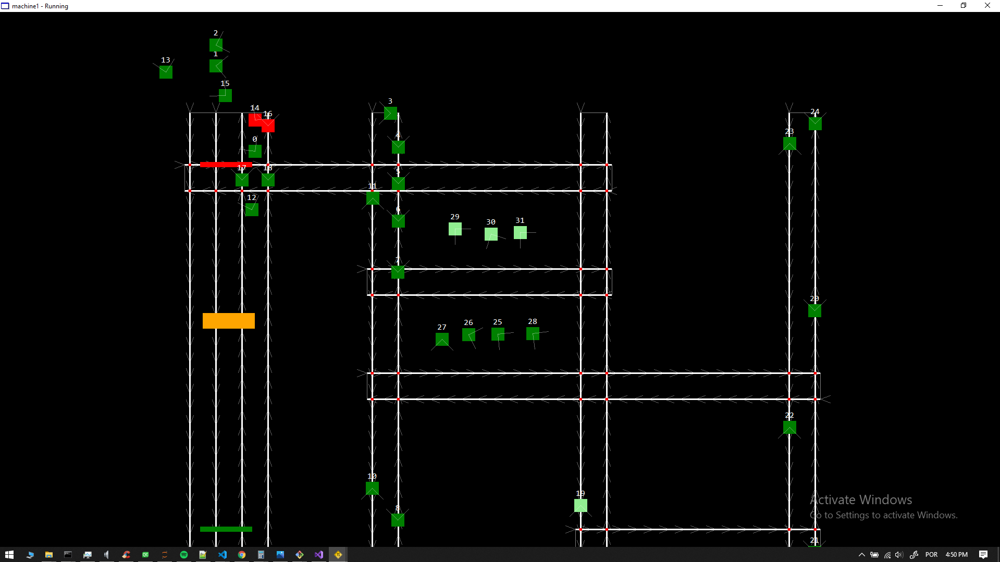
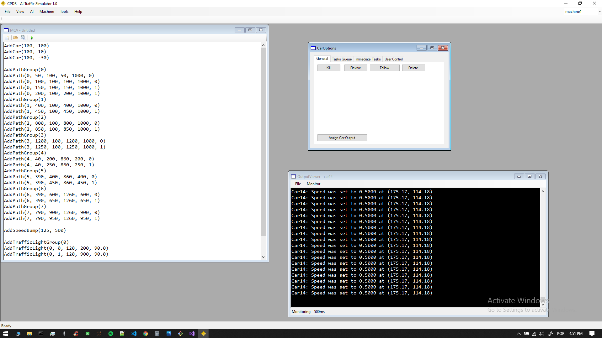

# TrafficSimulator

A Traffic Simulator useful for experiments and POCs.

# What is it?

This project contains the abstraction of some kind of cars and the drivers behaviors, it's a bidimensional world where 
a map (a Python script) can be imported and instantiate the vehicles anywhere.

I created this project some years ago to validate and test some of my pathfinding algorithms and some of my AI code.

# What can it do?
Currently the Car abstracted class deals with the following behaviors:

- They can avoid crashes by breaking and stopping if there is some obstacle ahead.
- They can break or slow down if there is a slower vehincle ahead
- It slows down when approaching a speed bump
- It slows down when approaching the end of a street
- It stops on traffic lights (when they are red)
- There is an reckless Car abstraction that can do speeding and crash on others cars
- When a car crashes they can't move anymore and may cause traffic jams
- When driving on a double track road they can change lanes when a car is blocking their way
- Every car have a specific FOV (Field of view) identified by the white lines on their front
- The cars can only react for events that happens on their field of view (e.g. stopping because of a jam)

# Traffic Simulator Environment

Every car can be tracked by the Traffic Simulator Environment, the user have total control of it, some of the features
you can do are:

- Break a car
- Move it by dragging and dropping it
- See an entire log of every behavior of each car
- Fix a broken or crashed car and make it move again
- Disable its automatic behavior and take the control of it

# How it was coded and how to modify it?

This is a Windows Forms C# application project, it is renderer using GDI+ and the maps are coded using Python.
All the linear algebra and analitic geometry calcs are in the Calc.cs class.
You can create custom behaviors for the cars by overloading the Car class.

# How to run it?

This project uses the IronPython library for running the Python scripts, so in order to run it you need to download
IronPython and reference it in the project.

https://ironpython.net/

Since it is a WF C# Application you just need the Visual Studio (2010 or newer), compile it and just run it.

There is also some test maps in the 'TestMaps' folder.
